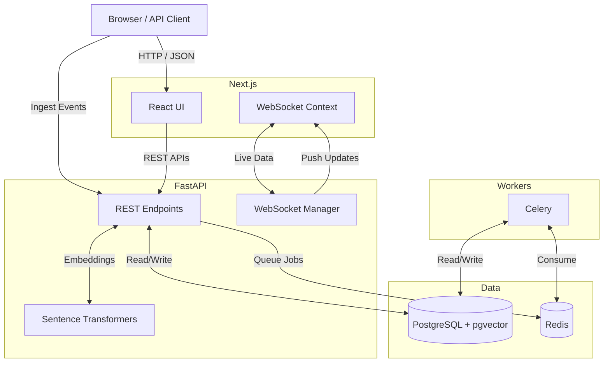

# Wexa AI 🚀

Hey! This is the repository for Wexa AI, a full-stack analytics platform I put together to handle real-time event tracking and AI-powered searching.

I got tired of clunky dashboards that require constant refreshing, so I built this with a heavy focus on **real-time WebSockets**. When an event happens, you see it instantly. It also uses `sentence-transformers` and `pgvector` under the hood, meaning you can search through thousands of logs using natural language (e.g., "show me database timeouts") instead of exact keyword matches.

---

## What's in the box? (Tech Stack)

I split the app into decoupled services so it's easy to deploy and scale.



- **Frontend:** Next.js 14, Tailwind, and Recharts.
- **Backend:** FastAPI (Python). It handles the JWT auth, the REST API, and manages the WebSocket rooms.
- **Database:** Postgres 15. I'm dumping event payloads into a `JSONB` column for flexibility, and storing the AI embeddings right alongside them using `pgvector`.
- **Background Jobs:** Celery + Redis. Used for crunching heavy weekly reports so the main API doesn't freeze up.

---

## Running it locally

The easiest way to get this running on your machine is Docker. You don't need to install Python or Node locally if you don't want to.

### 1. Set up your env vars
Copy the example env file in the backend directory:
```bash
cp backend/.env.example backend/.env
```
*(The defaults in `.env.example` will work perfectly fine for local Docker development).*

### 2. Spin it up
Run this from the root of the project:
```bash
docker-compose up -d --build
```

That's it. Docker will pull the images and start the database, Redis, the Python worker, the FastAPI server, and the Next.js frontend.

- **Frontend:** [http://localhost:3001](http://localhost:3001)
- **API Docs:** [http://localhost:8001/docs](http://localhost:8001/docs)

---

## Deploying to Production

If you want to put this on the internet, it's pretty straightforward since it's fully containerized.

1. **Frontend (Vercel):** Just connect your GitHub repo to Vercel and point it to the `frontend/` directory. Make sure you add an environment variable called `NEXT_PUBLIC_API_URL` and point it to your live backend.
2. **Backend (Railway or Render):** Connect your repo to Railway or Render, point it to the `backend/` folder, and it will automatically build the Dockerfile. They will inject a `$PORT` variable (which FastAPI is configured to listen to) and a `DATABASE_URL`. Just remember to attach a managed Postgres and Redis add-on in their dashboard!